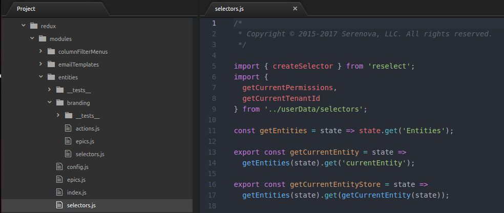
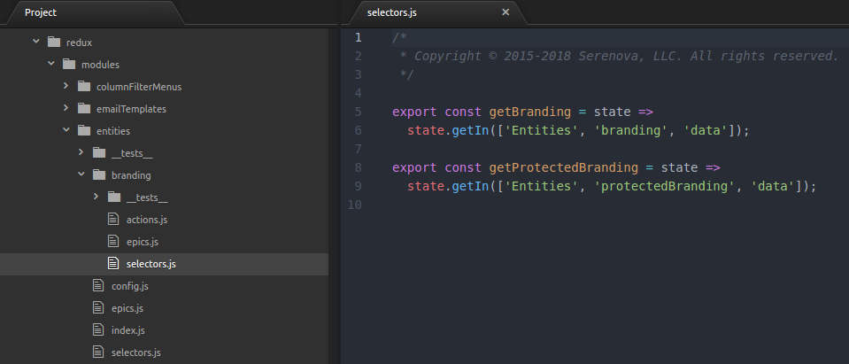

# Testing and code structure

## Table of contents
- [Components](#components)
- [Containers](#containers)
- [Selectors](#selectors)
- [Reducer](#reducer-index)
- [Epics](#epics)

## Introduction

The tests we write for cxengage-configuration-ui are proper solitary unit tests. Each test only tests a single function of code. All of the dependencies for that function of code will be mocked. This way, if we make updates to one of the code dependencies, it will not also affect the unit tests of the dependenants when it is changed. Each test suite should provide 100% code coverage. If each test suite has 100% coverage and follows the structure below, then our unit tests will be good and we will be able to refactor code and update project dependencies confidently.

## Components
Components are the view layer and should be very simple. They shouldn't have any complicated logic in them; all of the business logic should live in the epics and/or selectors. Typically, a component will have props that are functions and/or data (strings, numbers, booleans, etc.) that are displayed directly or are used as flags to render certains parts.

#### Testing

Given the following component:

```javascript
export default class MyComponent extends Component {
  componentDidMount() {
    this.props.functionCalledOnComponentDidMount();
  }

  render() {
    return (
      <div>
        {props.title}
        {props.showMessage ? 'Message' : 'Not showing message'}
        <button onClick={props.functionCalledOnButtonClick}
      </div>
    );
  }
}
```

We want to test:
1. The component renders properly, especially to capture the differences of render flags (like `showMessage`)
2. The prop functions are called

To test the rendering, we use [enzyme's `shallow` function](https://github.com/airbnb/enzyme/blob/master/docs/api/shallow.md) to render the component and [jest's `toMatchSnapshot` function](https://facebook.github.io/jest/docs/en/snapshot-testing.html) to create a snapshot of the rendered content and ensure it matches. You do not need to pass in actual functions to the render tests; they will be tested separately. You can test the different combinations of prop flags to get complete testing coverage:

```javascript
describe('MyComponent', () => {
  describe('with true showMessage', () => {
    it('renders "Message"', () => {
      expect(
        shallow(
          <MyComponent
            title="mock title"
            showMessage
            functionCalledOnComponentDidMount={() => {}}
            functionCalledOnButtonClick={() => {}}
          />
        )
      ).toMatchSnapshot();
    });
  });
  describe('with false showMessage', () => {
    it('renders "No message"', () => {
      expect(
        shallow(
          <MyComponent
            title="mock title"
            showMessage={false}
            functionCalledOnComponentDidMount={() => {}}
            functionCalledOnButtonClick={() => {}}
          />
        )
      ).toMatchSnapshot();
    });
  });
  // Other tests
});
```

To test prop functions that are called from DOM events, you can use the `shallow` function again to render the component and use it's `simulate` functions to produce the events. [Jest mock functions](https://facebook.github.io/jest/docs/en/mock-functions.html) can be used to ensure the function was called:

```javascript
describe('MyComponent', () => {
  describe('functionCalledOnButtonClick', () => {
    it('is called when the button is clicked', () => {
      const mockFunctionCalledOnButtonClick = jest.fn();
      const component = shallow(
        <MyComponent
          functionCalledOnComponentDidMount={() => {}}
          functionCalledOnButtonClick={mockFunctionCalledOnButtonClick}
        />
      );
      component.find('button').simulate('click');
      expect(mockFunctionCalledOnButtonClick).toBeCalled();
    });
  });
  // Other tests
});
```

To test prop functions called in the react `componentDidMount` and `componentDidUnmount` lifecycle events, you need to [`mount`](https://github.com/airbnb/enzyme/blob/master/docs/api/mount.md) the component:

```javascript
describe('MyComponent', () => {
  describe('functionCalledOnComponentDidMount', () => {
    it('is called on componentDidMount', () => {
      const functionCalledOnComponentDidMount = jest.fn();
      mount(
        <MyComponent
          functionCalledOnComponentDidMount={functionCalledOnComponentDidMount}
          functionCalledOnButtonClick={() => {}}
        />
      );
      expect(mockFunctionCalledOnButtonClick).toBeCalled();
    });
  });
  // Other tests
});
```

You can call `component.unmount()` to test functions called in `componentDidUnmount`.

## Containers
Containers are what connect parts of the redux store and actions to the components. To simplify the unit testing and make the contatiners consistent, the containers will be very simple; they will only map selectors and actions to the component. This way, the selectors and actions can be tested separately.

#### Testing

For the containers tests, we will test up to 3 things:

1. It can render. We don't bother testing the snapshot because the shallow render of a component doesn't provide anything useful.
2. (If mapStateToProps exists for the container) mapStateToProps gets the correct selectors and/or config imported to it
3. (If actions exist for the container) actions gets the correct actions imported to it

Given the following container:

```javascript
import { getData } from './selectors';
import { getConfigData } from './config';
import { myAction } from '../../redux/modules/myModule';

export function mapStateToProps(state) {
  return {
    dataFromSelector: getData(state),
    dataFromConfig: getConfigData()
  };
}

export const actions = {
  onSomeEvent: myAction
};

export default connect(mapStateToProps, actions)(MyComponent);
```

To test it can render, we mock a store (needed to render) and all of the imports to do a shallow render:

```javascript
import { mockStore } from '../../../utils/testUtils';
import MyContainer, { mapStateToProps, actions } from '../';

jest.mock('../../../redux/modules/myModule');

jest.mock('../selectors', () => ({
  getData: () => 'mock data',
}));

jest.mock('../config', () => ({
  getConfigData: () => 'mock config data'
}));

describe('MyContainer', () => {
  it('renders', () => {
    shallow(<MyContainer store={mockStore} />);
  });
});
```

To test the mapStateToProps returns the proper selectors/config and the actions returns the proper redux actions, we can simply make sure it matches a snapshot of it:

```javascript
describe('mapStateToProps', () => {
  it('maps the selectors to the object correctly', () => {
    expect(mapStateToProps()).toMatchSnapshot();
  });
});

describe('actions', () => {
  it('maps the redux actions to the object correctly', () => {
    expect(actions).toMatchSnapshot();
  });
});
```

## Selectors

Selectors are used to get the individual parts from state that we need to connect to our components. Typically, selectors will be [getting](https://facebook.github.io/immutable-js/docs/#/Map/get) sub state from the overall redux state:

```javascript
export const getMyModule = state => state.get('MyModule');
```

We will only have a few selectors getting their sub state directly from the `state` object. Usually (to reduce code duplication), selectors will be getting their state from another selector:

```javascript
export const getMySubModule = state => getMyModule(state).get('subModule');
```

Sometimes selectors contain more complicated logic (ex. nested `if` blocks) and/or computations (ex. `toJS()`, `JSON.parse()`) than a simple `get`/`getIn`. To prevent the same computations unnecessarily occuring for the same bit of state, we will use [reselect](https://github.com/reduxjs/reselect). Reselect takes in one or more pieces of state and does a comparison of them. If they are the same, it will return the same thing it computed the last time it was called.

```javascript
import { createSelector } from 'reselect';
import { getMySubModule } from 'src/redux/modules/myComponent/selectors'

export const getComputedValue = createSelector(
  getMySubModule,
  subModule => {
    if (subModule !== undefined) {
      subModule.toJS();
    }
    return subModule;
  }
)
```

#### File location

As the modules become large, we do not want our `selectors.js` to get enormous. Generic selectors will live in the module next to the reducer, epics, etc.:



If the selector is not generic and only would be used for one or very few components, they can be put into a submodule folder:



#### Testing

Testing for selectors is quite straightforward. For module selectors, you can pass in the state to the selector and verify it returns the correct sub state:

```javascript
import { fromJS } from 'immutable';
import { getMySubModule } from '../selectors';

describe('getMySubModule', () => {
  const initialState = fromJS({
    MyModule: {
      subModule: 'mock submodule'
    }
  });
  it('gets the sub module', () => {
    expect(getMySubModule(initialState)).toEqual('mock submodule');
  });
});
```

To test container and submodule containers (selectors that import and use module selectors), you can mock the module selectors so that the unit tests are decoupled:

```javascript
import { fromJS } from 'immutable';
import { getMySubModule } from 'src/redux/modules/myComponent/selectors';
import { getComputedValue } from '../selectors';

jest.mock('src/redux/modules/myComponent/selectors');

describe('getComputedValue', () => {
  describe('when sub module is defined', () => {
    getMySubModule.mockReturnValueOnce(fromJS({ mockKey: 'mock value'}));
    it('returns sub module converted to JS', () => {
      expect(getComputedValue()).toMatchSnapshot();
    });
  });
  describe('when sub module is undefined', () => {
    getMySubModule.mockReturnValueOnce(undefined);
    it('returns sub module converted to JS', () => {
      expect(getComputedValue()).toBe(undefined);
    });
  });
});
```

## Reducer (index)

In the `index.js` of each redux module, we declare the [reducer](https://redux.js.org/basics/reducers). This is where we define the initial state of the redux store and provide functions to modify it. We also declare [action creators](https://redux.js.org/basics/actions#action-creators) to simplify mapping them to our components.

#### Testing

Given the following module:

```javascript
import { fromJS } from 'immutable';

// Actions
export const setSubModule = subModule => ({
  type: 'SET_SUB_MODULE',
  subModule
});

// Initial state
const initialState = fromJS({
  subModule: undefined
});

// Reducer
export default function myModuleReducer(state = initialState, action) {
  switch (action.type) {
    case SET_SUB_MODULE:
      return state.set('subModule', action.subModule);
    default:
      return state;
  }
}
```

We want to test:
1. The inital state is correct
2. Each `case` in the reducer returns the correct modified state

Testing initial state is straightforward; we just make sure it matches a snapshot of it:

```javascript
import myModuleReducer from '../';

describe('myModule reducer', () => {
  it('returns the correct initial state', () => {
    expect(myModuleReducer(undefined, {})).toMatchSnapshot();
  });
  // Other tests
});
```

To test the reducer action handling, we pass in an initial state and the action into the reducer, then verify it matches what we expect:

```javascript
import myModuleReducer, {
  setSubModule
} from '../';

describe('myModule reducer', () => {
  describe('SET_SUB_MODULE', () => {
    it('sets the sub module', () => {
      const initialState = fromJS({ subModule: 'initial value' });
      expect(
        myModuleReducer(
          initialState,
          setSubModule('mock sub module')
        )
      ).toMatchSnapshot();
    });
  })
  // Other tests
});
```

##### Reducer helper functions

Sometimes the reducer action handlers are very similar, ex:

```javascript
...
  case SET_THING_TO_TRUE:
    return state.setIn(['a', 'b', 'c', 'd', 'e', 'f', 'g'], true);
  case SET_THING_TO_FALSE:
    return state.setIn(['a', 'b', 'c', 'd', 'e', 'f', 'g'], false);
...
```

So we will refactor the like code into a helper function:

```javascript
...
  case SET_THING_TO_TRUE:
    return setThing(state, true);
  case SET_THING_TO_FALSE:
    return setThing(state, false);
...

export const setThing = => (state, value) {
  return state.setIn(['a', 'b', 'c', 'd', 'e', 'f', 'g'], value);
}
```

Writing before and after tests for `SET_THING_TO_TRUE` and `SET_THING_TO_FALSE` would be redundant; they are ultimately doing the same thing. To test these, we would write before and after tests for `setThing` and then the tests for `SET_THING_TO_TRUE` and `SET_THING_TO_FALSE` would just be making sure we're calling `setThing` correctly. In order to mock a function within the same file, we need to call the exported function, so we would need to change the above to:

```javascript
...
  case SET_THING_TO_TRUE:
    return exports.setThing(state, true);
  case SET_THING_TO_FALSE:
    return exports.setThing(state, false);
...
```

Then be able to test the function being called using [jest's spyOn](https://facebook.github.io/jest/docs/en/jest-object.html#jestspyonobject-methodname) and the before and after tests with the actual function:

```javascript
import myModuleReducer, * as myModuleReducerFunctions from '../';

describe('myModule reducer', () => {
  ...
  describe('SET_THING_TO_TRUE', () => {
    it('calls setThing correctly', () => {
      const spy = jest
        .spyOn(entitiesReducerFunctions, 'setEntityUpdatingHelper')
        .mockImplementation(() => {});
      myModuleReducer(
        'mock initial state',
        myModuleReducerFunctions.setThingToTrue()
      );
      expect(spy).toMatchSnapshot();
      spy.mockRestore();
    });
  });
  describe('SET_THING_TO_FALSE', () => {
    it('calls setThing correctly', () => {
      const spy = jest
        .spyOn(entitiesReducerFunctions, 'setEntityUpdatingHelper')
        .mockImplementation(() => {});
      myModuleReducer(
        'mock initial state',
        myModuleReducerFunctions.setThingToFalse()
      );
      expect(spy).toMatchSnapshot();
      spy.mockRestore();
    });
  });
  describe('helper functions', () => {
    const initialState = fromJS({});
    expect(
      myModuleReducerFunctions.setThing(
        initialState,
        'mock thing value'
      )
    ).toMatchSnapshot();
  });
});
```

## Epics

[Epics](https://redux-observable.js.org/docs/basics/Epics.html) are used:

1. To handle async code calls (mainly calls to `sdkPromise` in this project)
2. To dispatch multiple actions
3. To handle all other side effects, like saving things to `localStorage`

#### File location

Follows the same approach as the [selectors](#file-location). Generic epics go in the module folder's `epics.js` and more specific ones go into a submodule folder (`/submodule/epics.js`).

#### Testing

##### API call through `sdkPromise`

A typical epic making an API call through `sdkPromise` would look something like:

```javascript
import 'rxjs/add/operator/mergeMap';
import 'rxjs/add/operator/map';
import 'rxjs/add/operator/catch';

import { fromPromise } from 'rxjs/observable/fromPromise';
import { Toast } from 'cx-ui-components';

import {
  doAThingFulfilled,
  doAThingRejected
} from './index';

export const DoAThing = (action$, store) =>
  action$.ofType('DO_A_THING').mergeMap(a =>
    fromPromise(
      sdkPromise(
        {
          module: 'entities',
          command: 'doAThing',
          data: a.values
        },
        'cxengage/do-a-thing-response'
      )
    )
      .map(response => {
        Toast.success('A thing happened!');
        return doAThingFulfilled(response);
      })
      .catch(error => {
        Toast.error(errorLabel(error));
        return doAThingRejected();
      })
  );
```

To test this, we want to verify:

1. The sdkPromise was called correctly
2. On success (`map()`):
  1. `Toast.success()` is called
  2. It returns `doAThingFulfilled`
3. On error (`catch()`):
  1. `Toast.error(errorLabel(error))` is called
  2. It returns `doAThingRejected`

```javascript
import { ActionsObservable } from 'redux-observable';
import { mockStore } from 'src/utils/testUtils';
import { DoAThing } from '../epics';
import { doAThing } from '../index';

import { sdkPromise, errorLabel } from 'src/utils/sdk';
import toastr from 'toastr';

jest.mock('src/utils/sdk');
jest.mock('toastr');

errorLabel.mockReturnValue('mock error');

describe('DoAThing', () => {
  let action;
  beforeEach(() => {
    action = ActionsObservable.of(doAThing('mock values'));
    sdkPromise.mockReturnValue(
      new Promise(resolve => resolve('mock response'))
    );
  });
  afterEach(() => {
    sdkPromise.mockClear();
    toastr.error.mockClear();
  });
  it('calls the correct sdk function', done => {
    DoAThing(action, mockStore).subscribe(() => {
      expect(sdkPromise).toMatchSnapshot();
      done();
    });
  });
  describe('on sdkPromise success', () => {
    it('calls toastr success', done => {
      DoAThing(action, mockStore).subscribe(() => {
        expect(toastr.success).toMatchSnapshot();
        done();
      });
    });
    it('returns doAThingFulfilled', done => {
      DoAThing(action, mockStore).subscribe(actualOutputActions => {
        expect(actualOutputActions).toMatchSnapshot();
        done();
      });
    });
  });
  describe('on sdkPromise success', () => {
    beforeEach(() => {
      sdkPromise.mockReturnValue(
        new Promise((resolve, reject) => reject('mock error'))
      );
    });
    it('calls toastr error', done => {
      DoAThing(action, mockStore).subscribe(() => {
        expect(toastr.error).toMatchSnapshot();
        done();
      });
    });
    it('returns doAThingRejected', done => {
      DoAThing(action, mockStore).subscribe(actualOutputActions => {
        expect(actualOutputActions).toMatchSnapshot();
        done();
      });
    });
  });
});
```

##### Mulptiple action dispatches

We also want to make epics for components, to keep them as simple as possible, when they have many actions that they want to dispatch at once. For example

```javascript
// Component
export default class MyComponent extends Component {
  componentDidMount() {
    this.props.callAction1('param a');
    this.props.callAction1('param b');
    this.props.callAction2();
    this.props.callAction3();
    this.props.callAction4();
  }

  render() {
    return <div>Content</div>;
  }
}

// Container
import {
  callAction1,
  callAction2,
  callAction3,
  callAction4
} from '../../redux/modules/myModule';

export const actions = {
  callAction1,
  callAction2,
  callAction3,
  callAction4
};

export default connect(null, actions)(MyComponent);
```

is a lot of logic for the component (which should be as much of "view layer only" as possible) and a lot of actions for the container to map. To solve this, we would make the following epic and be able to clean up the code:

```javascript
// Component
export default class MyComponent extends Component {
  componentDidMount() {
    this.props.initialize();
  }

  render() {
    return <div>Content</div>;
  }
}

// Container
import {
  initialize
} from '../../redux/modules/myModule';

export const actions = {
  initialize
};

export default connect(null, actions)(MyComponent);

// Epic
import 'rxjs/add/operator/mergeMap';
import import {
  callAction1,
  callAction2,
  callAction3,
  callAction4
} from '../index';

export const Initialize = action$ =>
  action$
    .ofType('INITIALIZE_$') // "_$" denotes that this action is only for dispatching other actions; will not have action listeners (redux side effects)
    .mergeMap(() => [
      callAction1('param a');
      callAction1('param b');
      callAction2();
      callAction3();
      callAction4();
    ]);
```

This dramatically cleans up the component and container, and decouples the logic/imports into one place: the epic. To test the epic, it is very simple:

```javascript
import { ActionsObservable } from 'redux-observable';
import { mockStore } from '../../../../../utils/testUtils';
import { Initialize } from '../epics';
import { initialize } from '../actions';

describe('Initialize', () => {
  it('calls all of the actions correctly', done => {
    const action = ActionsObservable.of(initialize());
    FetchBranding(action, mockStore).subscribe(actualOutputActions => {
      expect(actualOutputActions).toMatchSnapshot();
      done();
    });
  });
});
```
